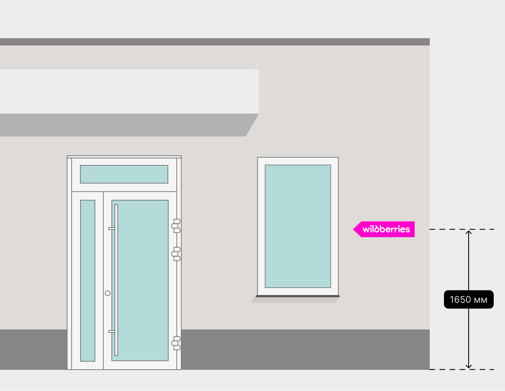

# Где и как разместить навигацию

<figure><figcaption></figcaption></figure>

По направлению к пункту выдачи, на уровне глаз — 1650 мм от пола.

Если выбрали место между окон или дверей, разместите табличку по центру между проёмами.

Если хотите приклеить стикер на витрину, тоже разместите его по центру.

Монтируйте теми же способами, что и табличку с режимом работы.\

<mark style="background-color:red;">Не забудьте согласовать навигацию перед тем, как приступить к монтажу.</mark>
