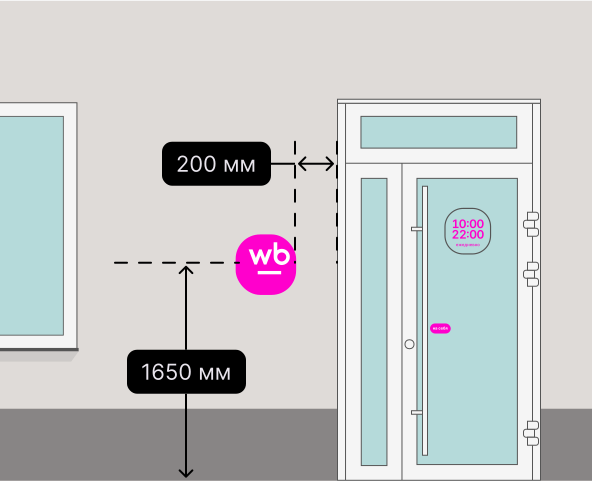
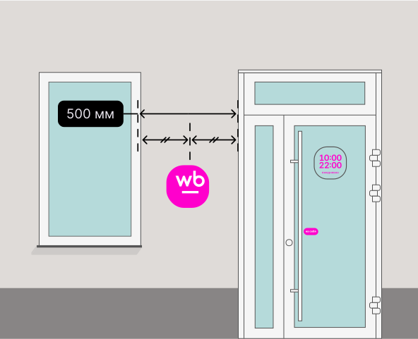
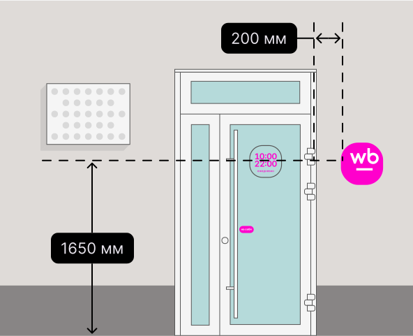

# Где разместить лайтбокс с режимом работы

<figure><figcaption></figcaption></figure>

Cлева от двери на уровне глаз, на высоте 1650 мм от пола.

\
Отступите 200 мм от дверного проёма.

<figure><figcaption></figcaption></figure>

Если расстояние от двери до окна больше 500 мм, установите лайтбокс ровно между ними. 
\
Если меньше, то справа от двери.

<figure><figcaption></figcaption></figure>

Справа от двери на уровне глаз и на высоте 1650 мм от пола.

\
Отступите 200 мм от дверного проёма.

<mark style="background-color:green;">Провода лучше скрыть. Если не получится, выведите кабель-канал. Не забывайте соблюдать требования к электропроводке. Подсветка должна работать круглосуточно</mark>
