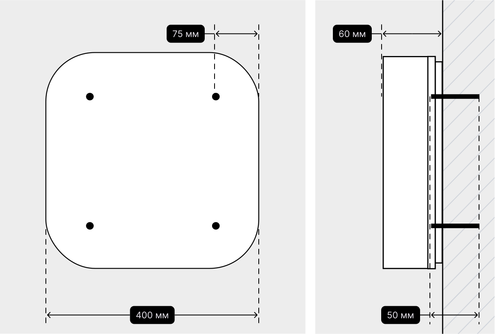

# Как установить лайтбокс с режимом работы

<figure><figcaption>
Размер: 400×400 мм. Глубина: 60 мм.
</figcaption></figure>

Просверлите отверстия в стене.

Приложите лайтбокс и плотно закрепите 
дюбелем с шурупом.

Лучше скрыть провода в стену. Если не получится, используйте кабель-канал. \
\
Пожалуйста, соблюдайте электротехнические нормы.
 Подсветка должна работать круглосуточно.
