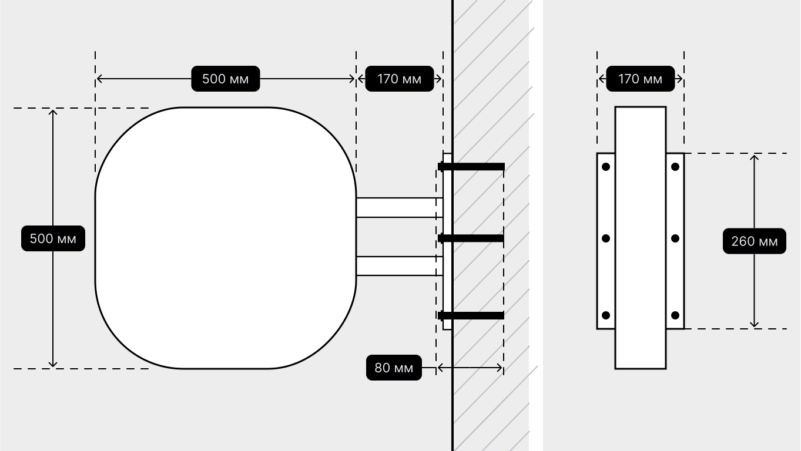

# Как установить панель-кронштейн

<figure><figcaption></figcaption></figure>

Установите перпендикулярно к основной вывеске на той же высоте.

Просверлите отверстия в стене, чтобы закрепить панель-кронштейн.

Приложите конструкцию к стене и плотно закрепите распорными анкерами. 
Скройте металлический
каркас и блок питания.
