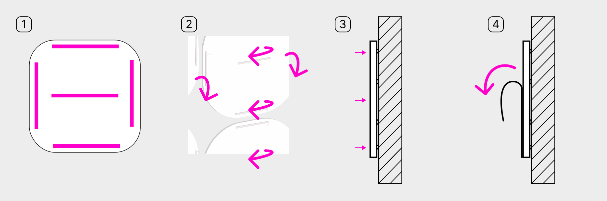

# Как установить табличку 
на двусторонний акриловый скотч

<figure><figcaption></figcaption></figure>

1. Приклейте на заднюю сторону таблички двусторонний скотч
2. Снимите защитную плёнку с внешней стороны скотча&#x20;
3. Сильно прижмите табличку к поверхности&#x20;
4. Снимите защитную плёнку с лицевой стороны таблички

