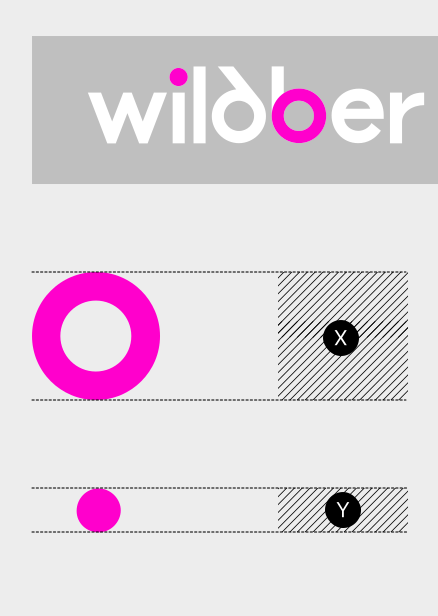

# Охранные поля

<figure><figcaption></figcaption></figure>

За величину **Х** берём размер окружности буквы **b** или **d** 
 \
За величину **Y** — размер 
точки строчной буквы **i**

<figure><figcaption></figcaption></figure>

1. Минимальное охранное поле

(сверху)

Вертикальное расстояние от низа вывески до базовой линии логотипа и от высоты прописных букв до верха вывески равно **Y**


2. Рекомендуемое охранное поле

(снижу)

Вертикальное расстояние от низа вывески до базовой линии логотипа равно **X**. От высоты прописных букв до верха вывески — **Х**+**Y**

