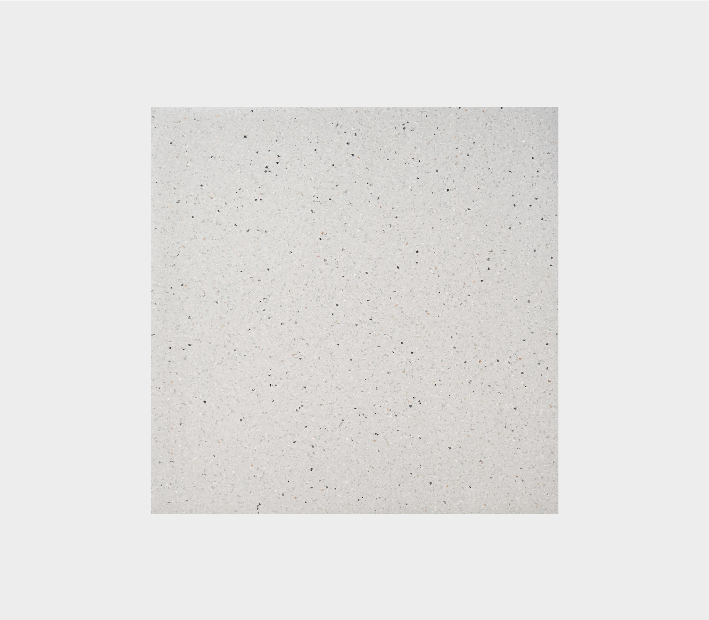

# Потолок и пол

## Напольное покрытие

Важно, чтобы напольное покрытие было ровным и не скользило.

Если проходимость высокая, лучше использовать плитку или коммерческий линолеум

<figure><figcaption></figcaption></figure>

## Плитка

<figure><figcaption></figcaption></figure>

Керамогранит терраццо светло-серого цвета от Kerama Marazzi

Размер: 600×600 мм

Cerezit\
цвет антрацит

Затирка\
цвет серый

## Как положить плитку

Начинайте от центра помещения, чтобы\
по краям остались отрезки одинаковой ширины

<figure><figcaption></figcaption></figure>

Не начинайте от угла — это нарушит симметрию&#x20;

<figure><figcaption></figcaption></figure>

## Плинтус

Рекомендуем сделать плинтус из плитки — так будет удобнее проводить влажную уборку

<figure><figcaption></figcaption></figure>

Выберите ту же плитку, что и для пола Размер: 600×200 мм

## Коммерческий линолеум

IQ ZENITH,\
оттенок 712

<figure><figcaption></figcaption></figure>

## Как постелить линолеум

<figure><figcaption></figcaption></figure>

Используйте специальный плинтус, чтобы завести линолеум на стену

Когда будете рассчитывать, сколько линолеума нужно, прибавьте к значению высоту специального плинтуса и ещё\
5 см на случай, если стены неровные

Укладывайте линолеум так, чтобы сварной шов проходил по короткой стороне помещения или под мебелью

## Альтернативный линолеум

<figure><figcaption></figcaption></figure>

Tarkett Acczent Pro Aspect 2 Tarkett Primo Plus 315

## Альтернативная плитка

<figure><figcaption></figcaption></figure>

Vitra Newcon K945786R0001VTE0 60x60см, цвет: белый КЕРАМОПРО Alma Light Gray 60x60см, цвет: серый

## Цвет краски

<figure><figcaption></figcaption></figure>

У нас общий цветовой код для всех пунктов выдачи.

Стены, колонны и проём на складе:\
светло-серый Dulux 10RB 83/012

Потолок, фартук и откосы: 
белая база Dulux

Угол открытого прохода на склад: 
Dulux 88RB 37/328

Подойдёт только матовая
моющаяся краска для стен

## Потолок

&#x20;.png>)

Потолок задаёт тон всему помещению. Сделайте его гладким и белым — так пункт выдачи будет казаться просторнее

## Способы отделки

<figure><figcaption></figcaption></figure>

Потолок из гипсокартона Подойдет в случаях, когда помещение небольшое\
и потолок нужно выравнивать

Простая окраска Используйте этот вариант, если на потолке нет больших кондиционеров и мало проводов. Для коробов и труб из оцинкованной стали нужны специальные эмали

Система грильято Покрасьте потолок в белый и установите систему\
с ячейками 10×10 см. Если размер будет меньше, пожарное оборудование придётся перенести\
с основного потолка на грильято — это сложнее

## Цвет потолка

<figure><figcaption></figcaption></figure>

Для открытого потолка\
и гипсокартона подойдёт только белая краска.

Если ставите систему грильято, окрасьте потолок\
и коммуникации в белый цвет

<figure><figcaption></figcaption></figure>

