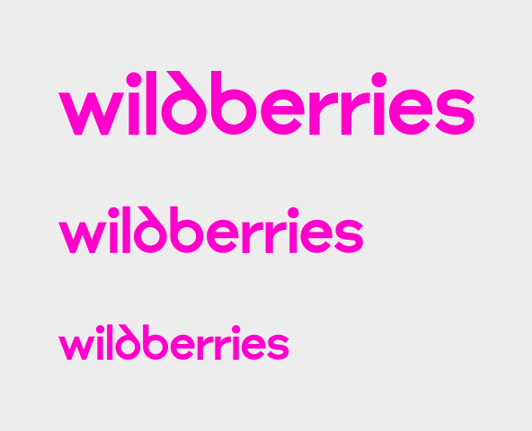
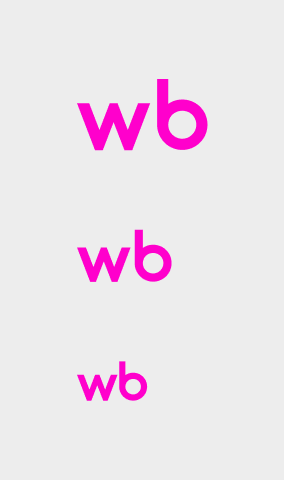

# Объёмные световые буквы на подрамнике

<figure><figcaption></figcaption></figure>

### Стандартная вывеска

Большая: 500×3400 мм
\
Средняя: 400×2720 мм
\
Маленькая: 300×2040 мм

<figure><figcaption></figcaption></figure>

### Короткая версия

Большая: 500×900 мм
\
Средняя: 400×720 мм
\
Маленькая: 300×540 мм

<figure><figcaption></figcaption></figure>

