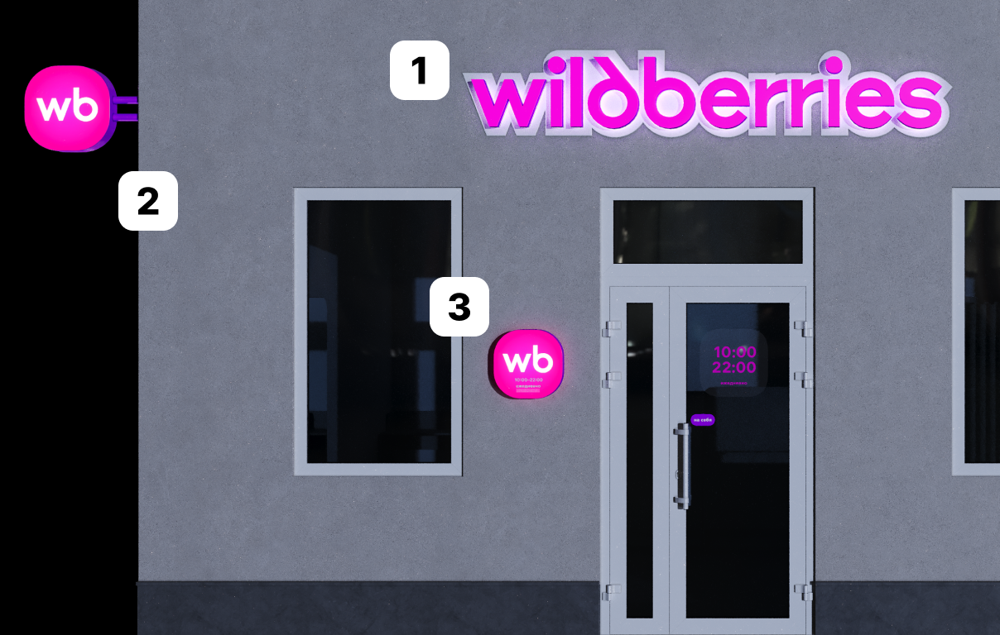

# Входная группа в ночное время

<figure><figcaption></figcaption></figure>

1. Вывеска
2. Панель-кронштейн
3. Лайтбокс

Так пункт должен выглядеть вечером. Позаботьтесь о том, чтобы вывеска, панель-кронштейн и лайтбокс с режимом работы светились и днём, и ночью.
