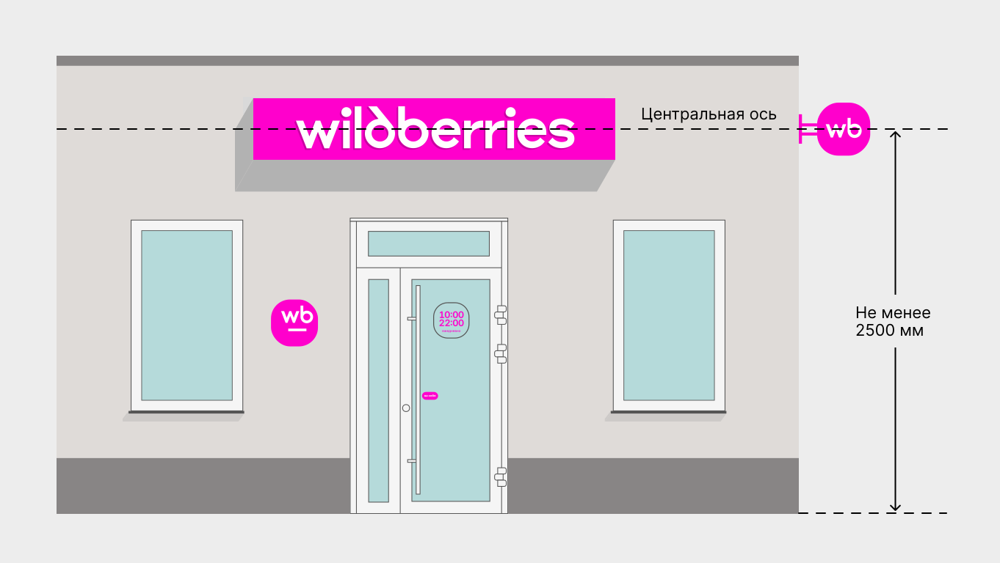

# Где разместить панель-кронштейн

<figure><figcaption></figcaption></figure>

Центральная ось панели-кронштейна, как и у вывески, — 
на линии перекрытия\*.
 Если на фасаде есть другие панели-кронштейны, расположите свой на одном уровне с ними.

Панель-кронштейн может быть справа или слева от вывески, но оставаться  в границах помещения, которое занимает пункт выдачи.\
\
\*Линия перекрытия проходит между 1-м и 2-м этажами.
