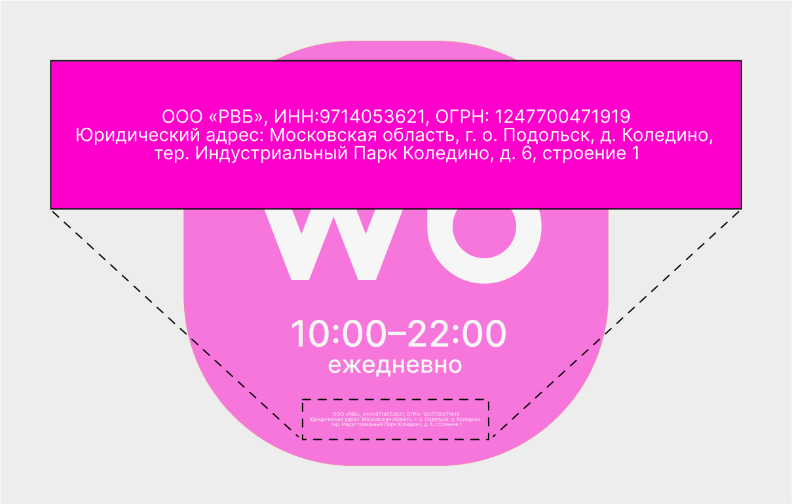

# Информация о собственнике

<figure><figcaption></figcaption></figure>

На табличке и лайтбоксе нужно указать юридическую информацию. Скачайте макет и заполните данные, а потом распечатайте стикер в типографии и приклейте его по инструкции.

Пожалуйста, сохраните оригинальный формат:

— кавычки-ёлочки: «» \
— текст в 3 строки \
— 1-ая строка: ИНН и ОГРН \
— 2-ая и 3-я строки: юридический адрес
