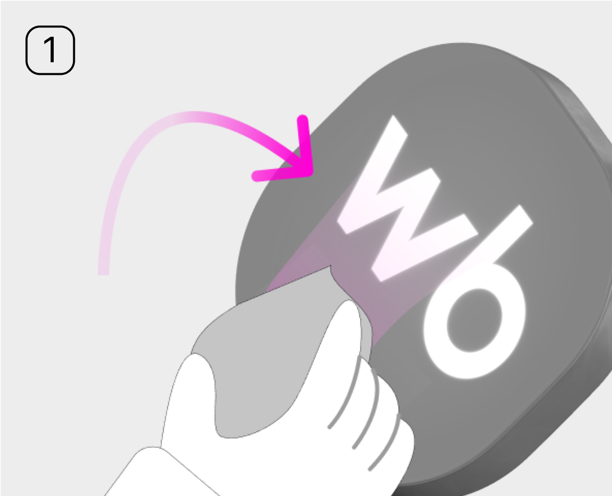
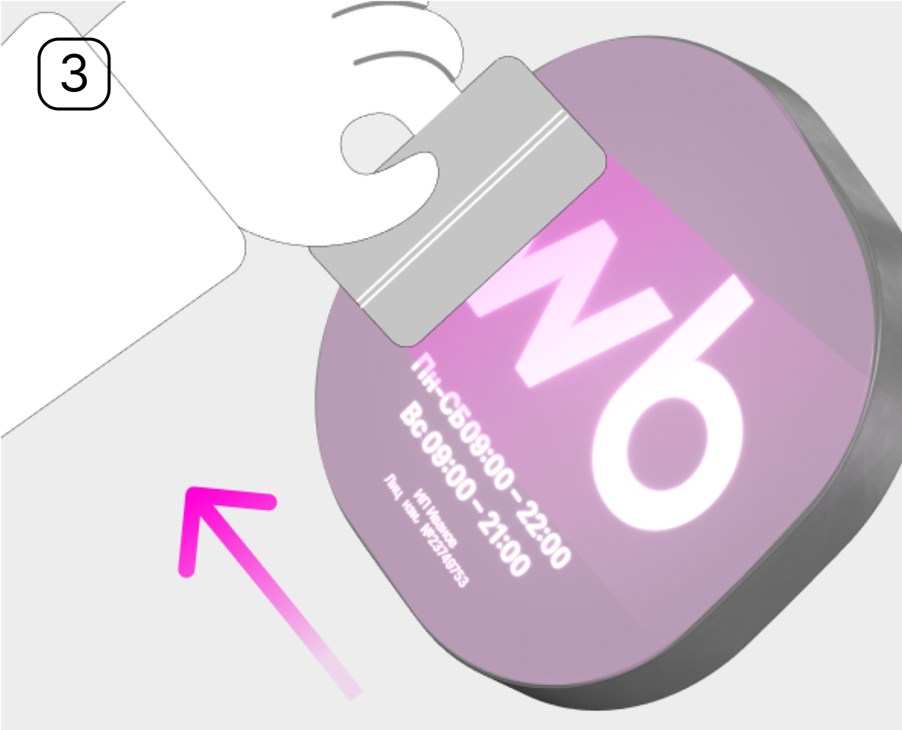

# Как наклеить стикер

<figure><figcaption></figcaption></figure>

Очистите лайтбокс или табличку спиртовой салфеткой и дождитесь, пока поверхность высохнет.

<figure><figcaption></figcaption></figure>

Отклейте защитный слой наклейки.

<figure><figcaption></figcaption></figure>

Приклейте стикер на лайтбокс или табличку. Используйте ракель или пластиковую карту, чтобы равномерно разгладить винил.
