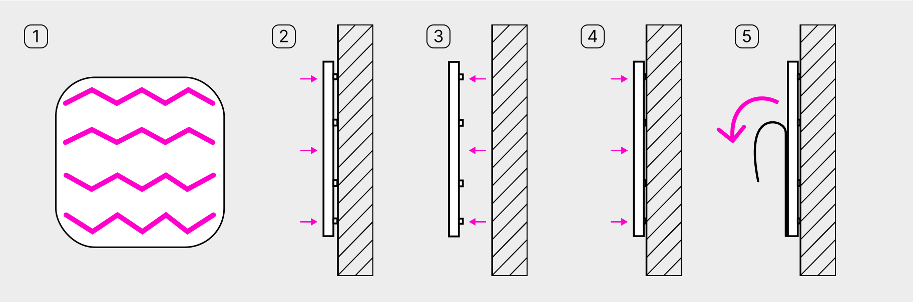

# Как установить табличку на жидкие гвозди или монтажный клей

<figure><figcaption></figcaption></figure>

1. Нанесите клей по периметру задней стороны таблички
2. Приложите табличку к стене и сразу же отклейте её от поверхности
3. Подождите 3-5 минут — так клей лучше схватится
4. Ещё раз приложите табличку к стене и сильно прижмите
5. Снимите защитную плёнку с лицевой стороны таблички
