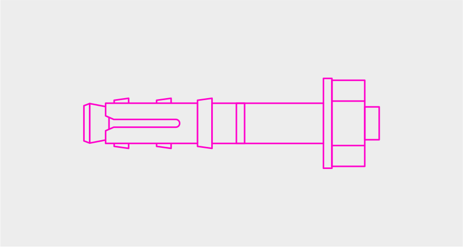
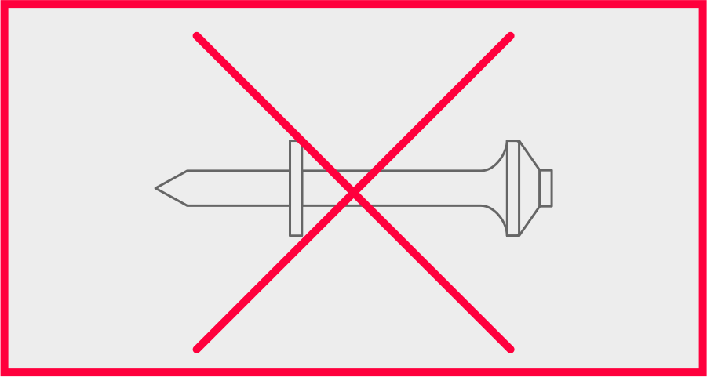

# Какие крепления выбрать

<figure><figcaption></figcaption></figure>

### Используйте анкеры

\

<figure><figcaption></figcaption></figure>

<mark style="background-color:red;">Не используйте дюбель-гвозди</mark>
