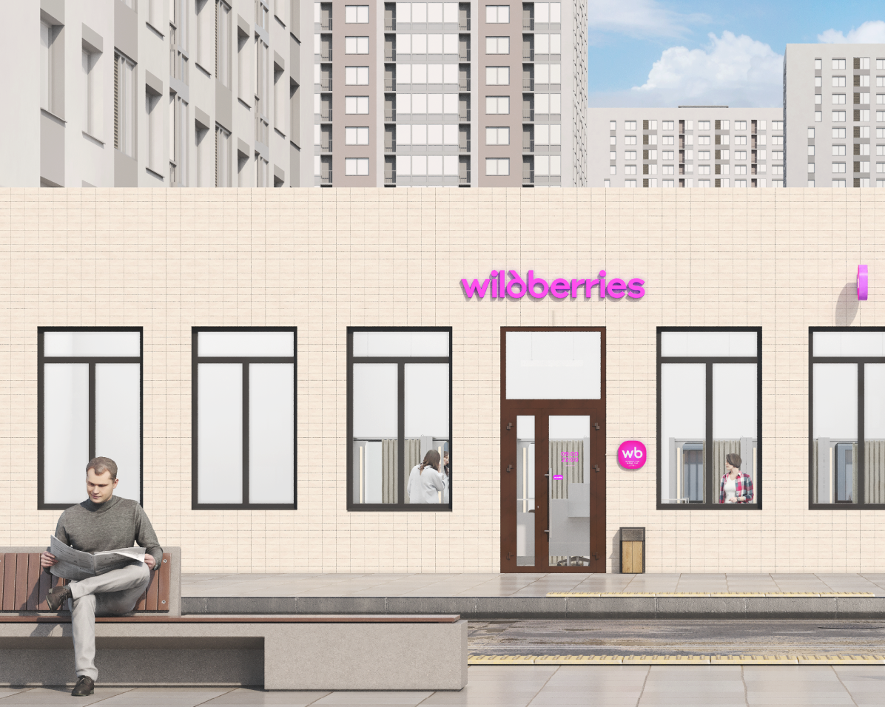

# Вход в пункт выдачи

<figure><figcaption></figcaption></figure>

Покупателям важно, как пункт выдачи выглядит снаружи. Если стены, лестница, козырёк, двери или окна в плохом состоянии, сделайте ремонт. Не забудьте установить урну для мусора.

\

Установите съезды и пандусы, чтобы людям на колясках и родителям с маленькими детьми было удобно.
