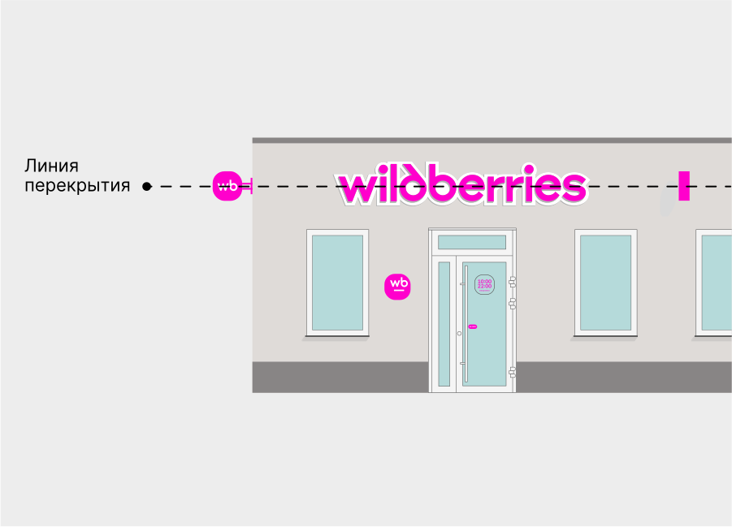
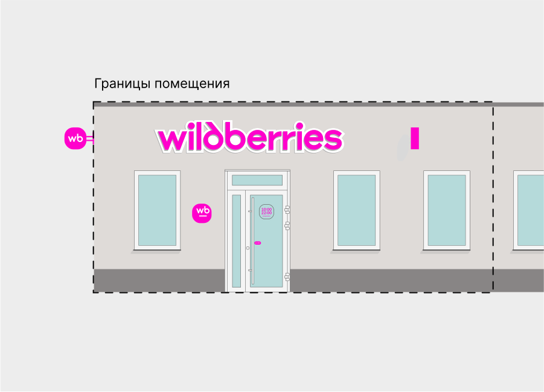

# Вывеска на фасаде

<figure><figcaption></figcaption></figure>

Центральная ось вывески — на линии перекрытия между 1-м и 2-м этажами. Если на фасаде есть другие вывески, расположите свою на одном уровне с ними.

<figure><figcaption></figcaption></figure>

Вывеска должна висеть в границах помещения пункта выдачи
